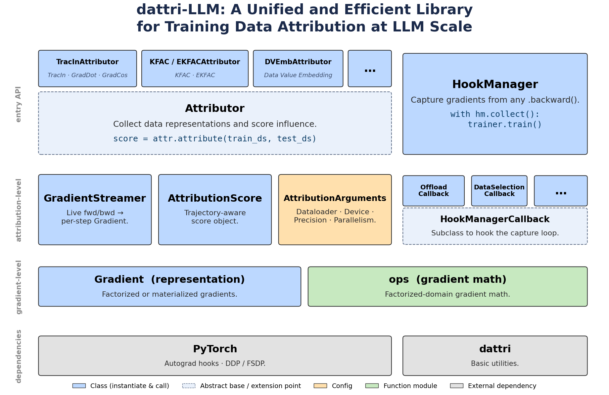

# dattri-llm

**Efficient training data attribution (TDA) infrastructure for LLM-scale models.**

<p align="center">
  
</p>

`dattri-llm` attributes a model's behavior back to individual training examples by
capturing and comparing per-sample gradients. Rather than maximizing the number of
supported TDA algorithms, it provides a **unified, efficient, and flexible
infrastructure** on which attribution methods can run at LLM scale:

- **Efficiency** —  Gradient operations (inner products,
  K-FAC quantities, projections) **route dynamically between the factorized and
  materialized representations**, picking whichever is cheaper for the shapes at
  hand. The factorized form is also what makes fine-grained per-token-position
  attribution practical.
- **Compatibility** — attribution is added by *wrapping* a training context rather
  than rewriting the training loop. Training procedures that call `.backward()` —
  pretraining, SFT, RL pipelines — can be wrapped, including the Hugging Face
  `Trainer` and OLMo.
- **Flexibility** — use a high-level attributor in one call, or wrap your own loop
  and attribute later from cached gradients; downstream applications include data
  selection, influence analysis, and token-level attribution.

`dattri-llm` is the LLM-scale companion of
[`dattri`](https://github.com/TRAIS-Lab/dattri), and is validated on `dattri`'s
official benchmark suite on attribution quality (LDS, LOO) and runtime. `dattri-llm` attributes LLM-scale models with only a few lines of code:

```python
import torch
from dattri.task import AttributionTask
from transformers import AutoModelForCausalLM, AutoTokenizer
from dattri_llm import AttributionArguments, TracInAttributor

tok = AutoTokenizer.from_pretrained("gpt2"); tok.pad_token = tok.eos_token
model = AutoModelForCausalLM.from_pretrained("gpt2")

def encode(*texts):
    ids = tok(list(texts), padding="max_length", max_length=32, return_tensors="pt")["input_ids"]
    return [{"input_ids": i} for i in ids]

train_set = encode("Influence functions trace a model's predictions back to its training data.",
                   "Preheat the oven and mix flour, sugar, and butter until crumbly.")
val_set = encode("Which training examples shaped this language model's behavior?")

def loss_fn(params, batch):
    ids = batch["input_ids"]
    return torch.func.functional_call(model, params, kwargs={"input_ids": ids, "labels": ids}).loss * len(ids)

task = AttributionTask(loss_func=loss_fn, model=model, checkpoints=[model.state_dict()])
attributor = TracInAttributor(AttributionArguments(output_dir="scores", use_cpu=True), task=task)
score = attributor.attribute(train_set, val_set)
print(score.agnostic_matrix()[1])  # (num_train, num_val) influence scores
```

```
tensor([[20337.7832],       # <- "Influence functions trace a model's ..."
        [16444.2383]])      # <- "Preheat the oven and mix flour, ..."
```

## Key Features

- 🪝 **Hook-based capture, zero training-loop changes** — `HookManager` registers
  PyTorch hooks on any model and assembles per-sample gradients after each
  forward/backward step:

  ```python
  with HookManager(model, callbacks=[...]).collect(deregister_on_exit=True):
      trainer.train()
  ```

- 👻 **Factorized per-sample gradients** — memory-efficient per-sample
  gradients from a single *batched* backward pass; scoring uses the "ghost inner
  product" (computed directly from the factors, without forming weight gradients)
  whenever it is cheaper than materializing.
- 🧩 **Pluggable callbacks** — behavior is added via callbacks, e.g.
  `OffloadCallback` (persist gradients to disk) and `DataSelectionCallback`
  (**online data selection**: drop low-influence samples' contributions from
  `param.grad` before the optimizer step, as if they were never in the batch).
- ⚡ **On-the-fly scoring or disk offloading** — attribute on-the-fly in one call
  with nothing persisted, or offload per-sample gradients to disk during customized training runs (no extra forward/backward) and attribute afterwards without the
  model — different attributors and settings re-run over the same cache for free
  (see [`examples/attribution/`](examples/attribution/)).
- 🌐 **Distributed-training support** — gradients captured under DDP and FSDP match
  the single-device reference; each rank writes its own shard and the store merges
  them transparently.
- 📚 **Broad layer coverage** — linear, convolution (incl. transposed), embedding,
  and normalization (`LayerNorm`, `RMSNorm`, `GroupNorm`, `InstanceNorm`) layers,
  with optional capture-time random projection.

## Quick Start

### Installation

```bash
git clone https://github.com/TRAIS-Lab/dattri-llm
cd dattri-llm
pip install -e .
pip install -e ".[transformers]"  # [Optional] + HF Trainer
```

### 1. Collect per-sample gradients during training

Wrap any training loop — the loop itself is untouched:

```python
from dattri_llm import (
    REGISTER_ALL, GradientFileManager, HookManager, HookManagerConfig, OffloadCallback,
)

fm = GradientFileManager("./train_grads")
hm = HookManager(
    model,
    config=HookManagerConfig(linear_io=REGISTER_ALL),  # factorized hooks on all eligible layers
    callbacks=[OffloadCallback(offload_interval=1, file_manager=fm,
                               recording_type="per_sample")],
)
with hm.collect():
    trainer.train()          # any loop that calls .backward()
hm.remove()
```

### 2. Attribute from cached gradients

No model or backward pass needed at attribution time:

```python
from dattri_llm import AttributionArguments, TracInAttributor

args = AttributionArguments(output_dir="./scores")
score = TracInAttributor(args).attribute_from_cache("./train_grads", "./test_grads")
train_ids, matrix = score.agnostic_matrix()   # (num_train, num_test)
```

### 3. Or do both in one call (on-the-fly)

Describe the target with a `dattri` `AttributionTask`; the attributor streams
gradients live and scores them — nothing is written to disk:

```python
from dattri.task import AttributionTask
from dattri_llm import AttributionArguments, TracInAttributor

task = AttributionTask(loss_func=loss_fn, model=model, checkpoints=[checkpoint])
attributor = TracInAttributor(AttributionArguments(output_dir="./out"), task=task)
score = attributor.attribute(train_dataset, test_dataset)
```

Scores are keyed by content hash, so a sample can also be looked up by identity:
`score.query(train_hashes, test_hashes)`.

See [`examples/`](examples/) for complete runnable scripts, including multi-GPU
collection and online data selection.

## Supported Algorithms

| Family | Attributor | Notes | Paper |
|---|---|---|---|
| Grad-Dot / Grad-Cos | `TracInAttributor` | single checkpoint; cosine via `normalized_grad=True` | [Charpiat et al., 2019](https://arxiv.org/abs/2102.05262) |
| TracIn | `TracInAttributor` | checkpoint ensemble along the training trajectory | [Pruthi et al., 2020](https://arxiv.org/abs/2002.08484) |
| K-FAC influence | `KFACAttributor` | Kronecker-factored inverse-Fisher preconditioning, fit from the training gradients | [Martens & Grosse, 2015](https://arxiv.org/abs/1503.05671) |
| EK-FAC influence | `EKFACAttributor` | Kronecker eigenbasis with empirical eigenvalues | [George et al., 2018](https://arxiv.org/abs/1806.03884); [Grosse et al., 2023](https://arxiv.org/abs/2308.03296) |
| DVEmb | `DVEmbAttributor` | trajectory-aware data value embeddings with GGN/Fisher propagation | [Wang et al., 2024](https://arxiv.org/abs/2412.09538) |
| Online data selection | `DataSelectionCallback` | gradient-alignment scoring + sample dropping inside the training step | — |

All attributors consume the same `GradientSource` contract (per-step
`(step, Gradient, hashes)` blocks), read either from disk or computed live, so new
methods plug into the same capture/storage/streaming infrastructure.

## Architecture

The library is organized in three layers:

```
dattri_llm/
├── utils/         # content hashing (sample identity), distributed helpers
├── gradient/      # Gradient data model, factorized ops, hooks, callbacks,
│                  # on-disk store, streaming sources
└── attribution/   # attributor interface, arguments, scores, algorithms
```

- **`utils/`** — generic helpers: content hashing that gives every sample a
  position- and shuffling-independent identity, and guarded
  `torch.distributed` utilities.
- **`gradient/`** — the gradient system: the `Gradient` data model
  (factorized or materialized), the math on factorized gradients, the
  `HookManager` and its callbacks for capture, the on-disk gradient store,
  and the streaming sources attributors read from.
- **`attribution/`** — the TDA methods: the attributor interface,
  `AttributionArguments`, the `AttributionScore` result container, and one
  module per algorithm.

## Related Projects

- [`dattri`](https://github.com/TRAIS-Lab/dattri) — general-purpose data attribution
  library and benchmark suite from the same group; `dattri-llm` targets LLM-scale
  models and training-framework integration.
