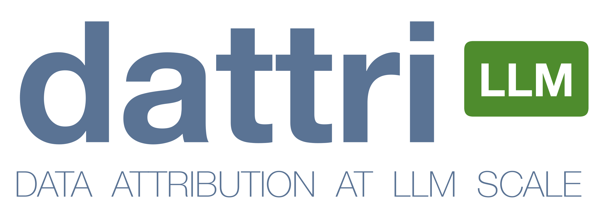
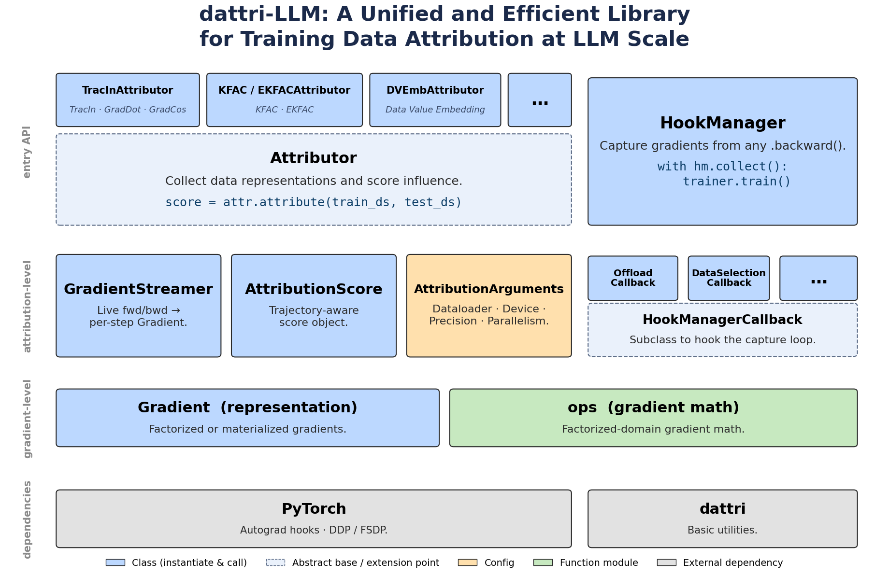
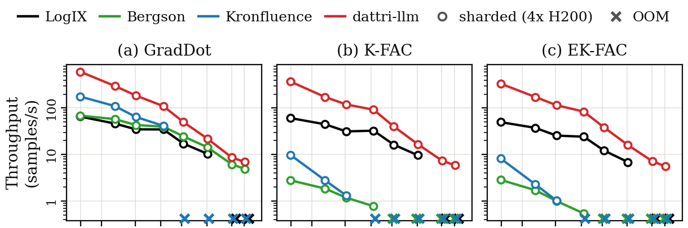

<div align="center">

</div>

# dattri-LLM: A Unified and Efficient Library for Training Data Attribution at LLM Scale

[](https://github.com/TRAIS-Lab/dattri-llm/blob/main/LICENSE)
[](https://github.com/TRAIS-Lab/dattri-llm/actions/workflows/pytest.yml)
[](https://github.com/TRAIS-Lab/dattri-llm/actions/workflows/lint.yml)
[](https://github.com/TRAIS-Lab/dattri-llm/tree/main/examples)
[](https://arxiv.org/abs/2609.38767)

[**Quick Start**](#quick-start)
| [**Algorithms, Models and Frameworks**](#algorithms-models-and-frameworks)
| [**Architecture**](#architecture)
| [**API Reference**](#api-reference)

## What is *dattri-LLM*?

<p align="center">
  
</p>

*dattri-LLM* is a PyTorch library for **efficient training data attribution (TDA) at LLM scale**. It captures per-example gradients from existing training loops and scores them with gradient-based attribution methods, built around one unified gradient interface:

- **Efficiency** — gradients are kept in exact factorized or materialized form, and a FLOP-aware cost model routes each operation to the cheaper one.
- **Compatibility** — autograd hooks capture gradients from any loop that calls `backward()`, with no change to the loop, optimizer or trainer. This covers DDP and FSDP, and pipelines built on Hugging Face Transformers, TRL and OLMo.
- **Extensibility** — the `Attributor` interface adds attribution methods over one shared gradient stream, and the `HookManagerCallback` interface adds applications that act during training, such as online data selection.

### Key Features

- 🪝 **Non-invasive capture** — wrap `trainer.train()` in
  `HookManager(...).collect()` and per-sample gradients are assembled from hooks
  after every step.
- 👻 **Factorized per-sample gradients** — one batched backward pass yields every
  sample's gradient as a (activation, output-gradient) pair; "ghost" inner products
  score them without ever forming the weight gradient when that is cheaper.
- ⚡ **On-the-fly or from disk** — attribute in one `attribute(...)` call with
  nothing persisted, or offload gradients during training and re-run any
  attributor over the same cache afterwards, without the model.
- 🧩 **Pluggable callbacks** — `OffloadCallback`, `KroneckerCovarianceCallback`,
  `OptimizerStateCallback` and `DataSelectionCallback` extend one capture path.
- 🌐 **Distributed by default** — gradients captured under DDP and FSDP match the
  single-device reference; each rank writes its own shard and the store merges them.
- 📚 **Broad layer coverage** — linear, convolution (incl. transposed), embedding
  and normalization layers (`LayerNorm`, `RMSNorm`, `GroupNorm`, `InstanceNorm`),
  with optional capture-time random projection.

*dattri-LLM* is the LLM-scale companion of [*dattri*](https://github.com/TRAIS-Lab/dattri)
and is validated on its benchmark suite for attribution quality (LDS, LOO) and
runtime. See [`examples/`](https://github.com/TRAIS-Lab/dattri-llm/tree/main/examples) for runnable scripts.

### Contents

- [dattri-LLM: A Unified and Efficient Library for Training Data Attribution at LLM Scale](#dattri-llm-a-unified-and-efficient-library-for-training-data-attribution-at-llm-scale)
  - [What is *dattri-LLM*?](#what-is-dattri-llm)
    - [Key Features](#key-features)
    - [Contents](#contents)
  - [Quick Start](#quick-start)
    - [Installation](#installation)
    - [1. Attribution from disk offloading](#1-attribution-from-disk-offloading)
    - [2. Attribution on-the-fly](#2-attribution-on-the-fly)
    - [3. Hugging Face norm layers (Llama / Qwen RMSNorm)](#3-hugging-face-norm-layers-llama--qwen-rmsnorm)
    - [4. Factorized versus materialized routing](#4-factorized-versus-materialized-routing)
  - [Algorithms, Models and Frameworks](#algorithms-models-and-frameworks)
    - [Algorithms](#algorithms)
    - [Capture requirements](#capture-requirements)
    - [Models and Frameworks](#models-and-frameworks)
  - [Efficiency](#efficiency)
  - [Architecture](#architecture)
  - [API Reference](#api-reference)
  - [Citation](#citation)
  - [Contributing](#contributing)
  - [Related Projects](#related-projects)
  - [License](#license)

## Quick Start

### Installation

```bash
git clone https://github.com/TRAIS-Lab/dattri-llm
cd dattri-llm
pip install -e .                  # core: torch + tqdm
pip install -e ".[transformers]"  # live attribution (attribute / GradientStreamer), HF Trainer
```

Python 3.10 or newer. The core install covers gradient capture (`HookManager`
and its callbacks), the on-disk store, and attribution from a cache
(`attribute_from_cache`). The live path — every attributor's one-call
`attribute(...)` and the `GradientStreamer` behind it — imports
`transformers`, so install the `transformers` extra for it. Optional extras:

| extra | installs | needed for |
|---|---|---|
| `transformers` | `transformers`, `accelerate` | live `attribute(...)` / `GradientStreamer`; the Hugging Face `Trainer` examples |
| `attribution` | `dattri` | dattri's random projectors (capture-time `logra` / `dense` projection) and dattri tasks |
| `trl` | `trl` | the TRL `SFTTrainer` / `GRPOTrainer` examples |
| `olmo` | `ai2-olmo` | the OLMo `Trainer` example ([`examples/trainers/olmo_trainer.py`](https://github.com/TRAIS-Lab/dattri-llm/blob/main/examples/trainers/olmo_trainer.py)) |
| `olmo-core` | `ai2-olmo-core==2.6.0` | the OLMo-core runs of [`experiments/fidelity`](https://github.com/TRAIS-Lab/dattri-llm/tree/main/experiments/fidelity) |
| `test` | `pytest` | running the test suite |
| `dev` | all of the above except `olmo-core`, plus the pinned lint tools (`ruff`, `pre-commit`) | development (see [CONTRIBUTING.md](https://github.com/TRAIS-Lab/dattri-llm/blob/main/CONTRIBUTING.md)) |

Extras combine, e.g. `pip install -e ".[transformers,attribution]"`.

### 1. Attribution from disk offloading

Wrap any training loop to offload per-sample gradients to disk — the loop
itself is untouched:

```python
from dattri_llm import (
    REGISTER_ALL, GradientStorageManager, HookManager, HookManagerConfig, OffloadCallback,
)

fm = GradientStorageManager("./train_grads")
hm = HookManager(
    model,
    config=HookManagerConfig(linear_io=REGISTER_ALL),  # factorized hooks on all eligible layers
    callbacks=[OffloadCallback(offload_interval=1, file_manager=fm,
                               recording_type="per_sample")],
)
with hm.collect():
    trainer.train()          # any loop that calls .backward()
hm.remove()
```

Then attribute from the cache — no model or backward pass needed, and
different attributors or settings re-run over the same cache for free:

```python
from dattri_llm import AttributionArguments, TracInAttributor

args = AttributionArguments(output_dir="./scores")
score = TracInAttributor(args).attribute_from_cache("./train_grads", "./test_grads")
train_ids, matrix = score.agnostic_matrix()   # (num_train, num_test)
```

### 2. Attribution on-the-fly

Describe the target with an `AttributionTask` — a `(model, batch) -> loss`
function evaluated on the live model, plus the checkpoints to score at; the
attributor streams gradients live and scores them, nothing is written to disk
(needs the `transformers` extra):

```python
from dattri_llm import AttributionArguments, AttributionTask, TracInAttributor

def loss_fn(model, batch):
    return model(**batch).loss

task = AttributionTask(loss_func=loss_fn, model=model)  # or checkpoints=[ckpt_a, ckpt_b]
attributor = TracInAttributor(AttributionArguments(output_dir="./out"), task=task)
score = attributor.attribute(train_dataset, test_dataset)
```

Scores are keyed by content hash, so a sample can also be looked up by identity:
`score.query(train_hashes, test_hashes)`.

Because the loss calls the model itself, the same task runs through a DDP or
FSDP wrapper; pass the wrapped model as `model`.

See [`examples/`](https://github.com/TRAIS-Lab/dattri-llm/tree/main/examples/) for complete runnable scripts, including multi-GPU
collection, online data selection, and one script per attribution method
([`examples/attribution/method_tour.py`](https://github.com/TRAIS-Lab/dattri-llm/blob/main/examples/attribution/method_tour.py)).

### 3. Hugging Face norm layers (Llama / Qwen `RMSNorm`)

Layer hyperparameters (a norm's `eps`, a convolution's `stride`, ...) are read
straight off each hooked module. Hugging Face's `LlamaRMSNorm` (also used by
Qwen and other families) is its own class and stores its epsilon as
`variance_epsilon`, so declare what the layer is and pass its hyperparameters
with the builders in `dattri_llm.utils.module`:

```python
from dattri_llm import HookManager, HookManagerConfig
from dattri_llm.utils.module import rms_norm_module_kwargs

norm = model.model.norm                               # a LlamaRMSNorm
config = HookManagerConfig(
    hook_types={"model.norm": "linear_io"},
    layer_types={"model.norm": "nn.RMSNorm"},         # what the layer is
    module_kwargs={"model.norm": rms_norm_module_kwargs(
        normalized_shape=norm.weight.shape[0], eps=norm.variance_epsilon,
    )},
)
hm = HookManager(model, config=config, callbacks=[...])
```

`layer_types` only relabels a layer; it does not select it for hooking.
Norm layers take the `"dense"` or `"mask"` projection styles, not `"logra"`.
The full recipe, including a check against autograd, is in
[`examples/projection/`](https://github.com/TRAIS-Lab/dattri-llm/blob/main/examples/projection/README.md).

### 4. Factorized versus materialized routing

A captured per-sample gradient is kept either **factorized** (a layer's input
activations and output gradients) or **materialized** (the dense per-sample
weight gradient). For a layer with input width `D`, output width `K` and `S`
tokens per sample, inner products route by flop count:

- **Scoring.** `dattri_llm.gradient.ops.maybe_use_materialized_gram(B1, B2, S, K, D)`
  picks materialize-then-GEMM when `B1·B2·S²·(D+K) ≥ (B1+B2)·S·D·K + B1·B2·D·K`,
  and `maybe_use_materialized_norm(S, K, D)` materializes per-sample norms when
  `S ≥ DK/(D+K)`. The inner-product ops (`ops.dot`, `ops.pairwise_dot`,
  `ops.cross_dot`, `Gradient.similarity`, ...) take `mode="auto"` (the rule),
  `"factorized"` or `"materialized"`; every mode is exact, only the cost differs.
- **Capture.** `HookManagerConfig(capture_style=...)` chooses what the backward
  hook buffers: `"factorized"` (default) keeps the factors, `"materialized"`
  contracts them at once, and `"auto"` applies the rule of
  `ops.should_materialize` per layer and micro-batch.

[`experiments/benchmark/routing.py`](https://github.com/TRAIS-Lab/dattri-llm/blob/main/experiments/benchmark/routing.py) compares
the cost model with each route pinned for every layer (`pin_route` in
`experiments/benchmark/utils/adapters/run_ours.py`).

## Algorithms, Models and Frameworks

### Algorithms

| Family | Attributor | Notes | Paper |
|---|---|---|---|
| Grad-Dot / Grad-Cos | `TracInAttributor` | single checkpoint; cosine via `normalized_grad=True` | [Charpiat et al., 2019](https://arxiv.org/abs/2102.05262) |
| TracIn | `TracInAttributor` | checkpoint ensemble along the training trajectory | [Pruthi et al., 2020](https://arxiv.org/abs/2002.08484) |
| K-FAC influence | `KFACAttributor` | Kronecker-factored inverse-Fisher preconditioning, fit from the training gradients | [Martens & Grosse, 2015](https://arxiv.org/abs/1503.05671) |
| EK-FAC influence | `EKFACAttributor` | Kronecker eigenbasis with empirical eigenvalues | [George et al., 2018](https://arxiv.org/abs/1806.03884); [Grosse et al., 2023](https://arxiv.org/abs/2308.03296) |
| DVEmb | `DVEmbAttributor` | trajectory-aware data value embeddings with GGN/Fisher propagation | [Wang et al., 2024](https://arxiv.org/abs/2412.09538) |
| LESS | `LESSAttributor` | cosine between a query's gradient and a sample's Adam update direction, summed over checkpoints with the learning rate as weight | [Xia et al., 2024](https://arxiv.org/abs/2402.04333) |
| AdamW-influence | `AdamWInfluenceAttributor` | first-order influence unrolled through the AdamW trajectory from the recorded optimizer moments; every coordinate or a random mask per layer | [Deng et al., 2026](https://arxiv.org/abs/2605.18814) |
| Online data selection | `DataSelectionCallback` | gradient-alignment scoring + sample dropping inside the training step | — |

All attributors consume the same `GradientSource` contract (per-step
`(step, Gradient, hashes)` blocks), read either from disk or computed live, so new
methods plug into the same capture/storage/streaming infrastructure.

### Capture requirements

Each method's live `attribute(...)` sets up this capture itself. When you capture
from your own training loop and score with `attribute_from_cache(...)`, record what
the method reads. All callbacks below are importable from `dattri_llm`.

| Attributor | Train-side gradients | Also recorded |
|---|---|---|
| `TracInAttributor` | raw | — |
| `KFACAttributor`, `EKFACAttributor` | raw | Kronecker covariances: a fit pass over the store, or `KroneckerCovarianceCallback` at capture, passed as `fit(covariances=...)` |
| `LESSAttributor` | preconditioned, captured with `HookManager(optimizer=...)`; queries are raw | the learning rate per step (trajectory form), or the optimizer state per checkpoint (frozen form, `optimizers=`) |
| `AdamWInfluenceAttributor` | raw, per step; or parameter snapshots (`ParameterSnapshotCallback`) to recompute them | the moments before and after every update: `OptimizerStateCallback`, with `record_post(step)` called after each `optimizer.step()`; pass `callback.dynamics()` as `dynamics=` |
| `DVEmbAttributor` | raw, per step; or parameter snapshots | the learning-rate schedule, passed as `learning_rate=` |

Preconditioned capture needs exact gradient entries: it takes no projection, a
`"mask"` or a `"dense"` projection (applied after the map), but not the `"logra"`
factor projection, and it rejects `param_grad` layers. Without a mask, each
hooked layer's per-sample gradient is materialized before the map.

### Models and Frameworks

**Models** — Our hook-based implementation is compatible with any `nn.Module`, enabling support for a broad range of LLM architectures, including the GPT-2, Llama, Qwen, and Gemma families.

**Frameworks** — Our library integrates directly with a variety of training frameworks, including but not limited to
[Transformers](https://github.com/huggingface/transformers),
[TRL](https://github.com/huggingface/trl), and
[OLMo](https://github.com/allenai/OLMo).
See [`examples/trainers`](https://github.com/TRAIS-Lab/dattri-llm/tree/main/examples/trainers) for detailed examples.

## Efficiency

Efficiency benchmark results of *dattri-LLM* against [Bergson](https://github.com/EleutherAI/bergson), [Kronfluence](https://github.com/pomonam/kronfluence) and [LogIX](https://github.com/logix-project/logix) on 0.5B to 110B models under an equal workload. See the paper and [`experiments/benchmark`](experiments/benchmark) for the full results.

<p align="center">
  
</p>

## Architecture

The library is organized in three layers:

```
dattri_llm/
├── utils/         # content hashing (sample identity), distributed helpers
├── gradient/      # Gradient data model, factorized ops, hooks, callbacks,
│                  # on-disk store, streaming sources
└── attribution/   # attributor interface, arguments, scores, algorithms
```

- **`utils/`** — generic helpers: content hashing that gives every sample a
  position- and shuffling-independent identity, and guarded
  `torch.distributed` utilities.
- **`gradient/`** — the gradient system: the `Gradient` data model
  (factorized or materialized), the math on factorized gradients, the
  `HookManager` and its callbacks for capture, the on-disk gradient store,
  and the streaming sources attributors read from.
- **`attribution/`** — the TDA methods: the attributor interface,
  `AttributionArguments`, the `AttributionScore` result container, and one
  module per algorithm.

## API Reference

[`docs/API.md`](https://github.com/TRAIS-Lab/dattri-llm/blob/main/docs/API.md) indexes the public API: what `dattri_llm` exports
at the top level and what each subpackage (`dattri_llm.gradient`,
`dattri_llm.gradient.ops`, `dattri_llm.attribution`, `dattri_llm.utils`)
provides, and the `Literal` option types in `dattri_llm.options`. The package
ships a `py.typed` marker, so type checkers read its inline annotations.
Extension bases are exported too: `TrajectoryAttributor` (the trajectory
methods' base), `ReplayGradientSource` and `TrajectorySnapshots`. Every public class and function carries a docstring; use
`help(dattri_llm.TracInAttributor)` and the like for signatures.

## Citation

If you use *dattri-LLM* in your research, please cite the paper:

```bibtex
@article{liu2026dattrillm,
  title   = {dattri-LLM: A Unified and Efficient Library for Training Data Attribution at LLM Scale},
  author  = {Liu, Shixuan and Zhou, Tongli and Deng, Junwei and Hu, Pingbang and Ma, Jiaqi W.},
  journal = {arXiv preprint arXiv:2609.38767},
  year    = {2026}
}
```

## Contributing

See [CONTRIBUTING.md](https://github.com/TRAIS-Lab/dattri-llm/blob/main/CONTRIBUTING.md) for the development setup, the lint and
test commands CI runs, and the pull-request conventions.

## Related Projects

- [`dattri`](https://github.com/TRAIS-Lab/dattri) — general-purpose data attribution
  library and benchmark suite from the same group; `dattri-llm` targets LLM-scale
  models and training-framework integration.

## License

`dattri-llm` is released under the [MIT License](https://github.com/TRAIS-Lab/dattri-llm/blob/main/LICENSE).
